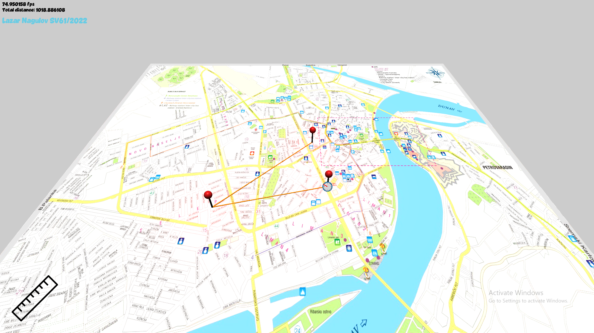
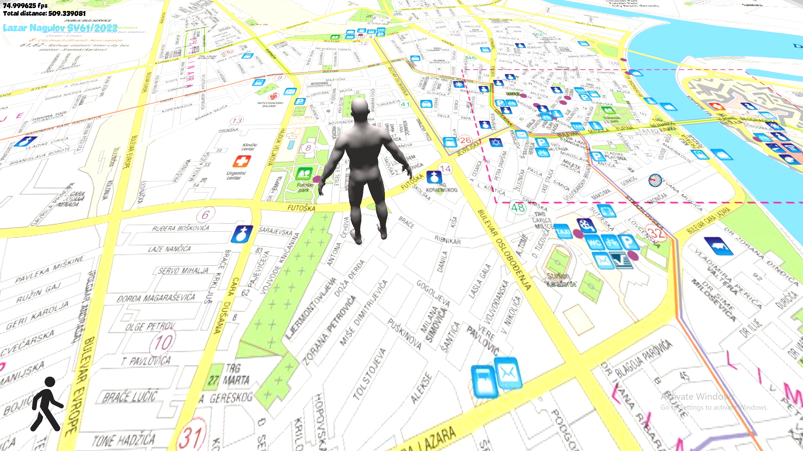
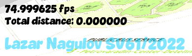

<a id="readme-top"></a>

[![Last Commit][last-commit-shield]][last-commit-url]


<div align="center"> 
    <h1 align="center">3D Map</h1> 
    <p align="center"> <br /> 
        <a href="https://github.com/lazarnagulov/3d-map/issues/new?labels=bug">Report Bug</a> 
    </p> 
</div> 

<details>
  <summary>Table of Contents</summary>
  <ol>
    <li>
      <a href="#about-the-project">About The Project</a>
      <ul>
        <li><a href="#built-with">Built With</a></li>
      </ul>
    </li>
    <li><a href="#screenshots">Screenshots</a></li> 
    <li><a href="#installation">Installation</a></li>
    <li><a href="#controls">Controls</a></li>
    <li>
      <a href="#project-structure">Project Structure</a>
      <ul>
        <li><a href="#key-design-patterns">Key Design Patterns</a></li>
      </ul>
    </li>
    <li>
      <a href="#configuration">Configuration</a>
      <ul>
        <li><a href="#adjusting-settings">Adjusting Settings</a></li>
        <li><a href="#custom-map">Custom Map</a></li>
        <li><a href="#custom-character-model">Custom Character Model</a></li>
      </ul>
    </li>
    <li>
      <a href="#development">Development</a>
      <ul>
        <li><a href="#adding-new-layers">Adding New Layers</a></li>
        <li><a href="#extending-the-renderer">Extending the Renderer</a></li>
      </ul>
    </li>
    <li><a href="#acknowledgments">Acknowledgments</a></li>
  </ol>
</details>

## About The Project



This project is a 3D C++/OpenGL application designed for interactive navigation and distance measurement on a three-dimensional map. Building upon the foundation of the [2D map project](https://github.com/lazarnagulov/2d-map), this application extends the concept into a 3D environment with an overhead perspective camera, dynamic lighting, and interactive 3D models.

The rendering pipeline utilizes modern OpenGL (3.3+ core profile) with programmable shaders, implementing lighting effects, texture mapping, and model rendering to create an interactive map visualization.

The application features two interactive modes:

1. **Walking Mode** - A humanoid character model navigates across the map plane using WASD controls. The character rotates to face the direction of movement. An overhead camera with a fixed downward angle (slightly angled for better perspective) provides the view. Movement distance is continuously tracked and displayed as a 2D overlay in the corner of the screen.

2. **Measurement Mode** - The camera elevates to a higher y-position for a better overview. Users can place measurement points anywhere on the map using mouse clicks. Each point is visualized as a 3D pin (narrow cylinder with a red sphere on top) that emits red light. Consecutive points are connected by lines drawn on the map surface, with the total measured distance displayed as a 2D overlay.

The camera moves independently using arrow keys and is constrained to the map boundaries on the x and z axes. The mouse cursor moves freely in 3D space to interact with UI icons and place measurement points. Mode switching is performed via keyboard (R) or clicking mode icons in the UI overlay.

<p align="right">(<a href="#readme-top">back to top</a>)</p>

## Built with

This project is implemented entirely in C++ and uses a modern OpenGL programmable pipeline along with several supporting libraries for rendering, input, and texture handling.

* [![C++][C++]][C++-url]
* [![OpenGL][OpenGL]][OpenGL-url]
* [![GLFW][GLFW]][GLFW-url]
* [![GLEW][GLEW]][GLEW-url]
* [![Assimp][Assimp]][Assimp-url]
* [![FreeType][FreeType]][FreeType-url]
* [![GLM][GLM]][GLM-url]

<p align="right">(<a href="#readme-top">back to top</a>)</p>

## Screenshots

| Preview | Description |
|---------|-------------|
|  | Walking mode with humanoid character navigating the map |
|  | Measurement mode with 3D pins (cylinders with glowing red spheres) |
|  | Semi-transparent 2D overlay with student name and index |

<p align="right">(<a href="#readme-top">back to top</a>)</p>

## Installation

Follow the steps below to build and run the project locally.

#### 1. Clone the repository

If the project includes third-party components inside the repo (fonts, shader sources, textures, etc.),
make sure to clone **recursively**:

```bash
git clone --recursive https://github.com/lazarnagulov/3d-map.git
cd 3d-map
```

If you forgot --recursive:
```bash
git submodule update --init --recursive
```

#### 2. Configure with CMake

Create a build folder and generate project files:
```bash
mkdir build
cd build
cmake ..
```

#### 3. Build & Run

You may now build the project in two ways:
- Open in Visual Studio / run .sln
- Build with CMake directly
```bash
cmake --build . --config Release
./3d-map  
```
<p align="right">(<a href="#readme-top">back to top</a>)</p>

## Controls

| Action | Input |
|-------|-------|
| Move across map (Walking Mode) | **W / A / S / D** |
| Move camera | **Arrow keys** |
| Place a point (Measurement Mode) | **Left Mouse Click** |
| Remove a point (when hovering on it) | **Left Mouse Click** |
| Switch mode (Walk ↔ Measure) | **R** or click mode icon |
| Reset current mode state (distance or path) | **0** |
| Depth test | **F1** |
| Toggle face culling | **F2** |
| Exit application | **ESC** |

Cursor is visually represented as a **compass**, with the red needle pointing toward the **upper-left corner**.

<p align="right">(<a href="#readme-top">back to top</a>)</p>


## Project Structure

The project follows a layered architecture with clear separation of concerns:
```
3d-map/
├── src/
│   ├── core/              # Engine-level components
│   │   ├── rendering/     # Renderer, shaders, textures, buffers, models, meshes
│   │   ├── window/        # Window management, camera
│   │   ├── input/         # Input handling
│   │   ├── layers/        # Layer system (base classes)
│   │   └── utils/         # Frame limiter, utilities
│   ├── app/               # Application-specific code
│   │   ├── systems/       # EventDispatcher, LayerManager
│   │   ├── layers/        # WalkLayer, MeasureLayer, ModeLayer, CompassCursorLayer
│   │   └── states/        # AppState, WalkState
│   └── assets/
│       ├── shaders/       # GLSL vertex/fragment shaders
│       ├── textures/      # Map image, icons, cursor
│       ├── models/        # Humanoid character model, cylinder, sphere
│       └── fonts/         # TrueType fonts for text rendering
```

### Key Design Patterns

- **Layer System**: Modular UI/logic components that can be enabled/disabled
- **Event Dispatching**: Centralized input routing to active layers
- **State Management**: Separate state objects for persistent data

<p align="right">(<a href="#readme-top">back to top</a>)</p>

## Configuration

### Adjusting Settings

You can modify various parameters in `Application.cpp`:
```cpp
// Frame rate
app.Run(60.0f);  // Target 60 FPS

// Camera move speed
const float moveSpeed = 300.0f;

// Default light
sceneLights.push_back({
    { 0.0f, 1.0f, 0.0f },  
    glm::vec3(1.0f, 1.0f, 1.0f),      
    1.0f                  
});

```

### Custom Map

To use your own map image:
1. Replace `./src/assets/textures/map.jpg` with your image
2. Recommended resolution: 2048x2048 or higher for best quality
3. Supported formats: JPG, PNG (via stb_image)

<p align="right">(<a href="#readme-top">back to top</a>)</p>

### Custom Character Model

To use your own humanoid character model:

1. **Replace the character model**: `./src/assets/models/player.obj` 
2. **Ensure the model**:
   - Is properly scaled
   - Faces forward (positive Z direction) in its default orientation
   - Has appropriate materials/textures
3. **Update model loading code** if using a different file format

<p align="right">(<a href="#readme-top">back to top</a>)</p>

## Development

### Adding New Layers

To create a custom layer:
```cpp
// 1. Create your layer class
class MyLayer : public Layer {
public:
    void OnUpdate(float dt) override { /* ... */ }
    void OnRender(Renderer& renderer) override { /* ... */ }
    void OnKey(int key, int action) override { /* ... */ }
};

// 2. Add to Application constructor
m_MyLayer(m_LayerManager.AddLayer<MyLayer>(/* args */))
```

### Extending the Renderer

The `Renderer` class supports:

**2D Rendering Methods:**
- **`DrawQuad()`** — Draw textured or colored rectangles (UI elements, icons)
- **`DrawLine()`** — Draw 2D lines with thickness
- **`DrawCircle()`** — Draw filled or outlined circles
- **`DrawText()`** — Render text using FreeType fonts

**3D Rendering Methods:**
- **`DrawMesh()`** — Render individual 3D meshes with materials, textures, and transformations
- **`DrawModel()`** — Render complete 3D models (humanoid character, etc.)

**Scene Management:**
- **`BeginScene(viewProjection)`** — Start 2D render pass with camera
- **`BeginScene(viewProjection, cameraPos)`** — Start 3D render pass with camera and lighting
- **`EndScene()`** — Finalize render pass
- **`UploadLights(lights)`** — Upload point light data to shaders (supports up to 16 lights)

**Render State Control:**
- **`SetDepthMode(mode)`** — Enable/disable depth testing
- **`ApplyRenderSettings(settings)`** — Configure depth testing and face culling
<p align="right">(<a href="#readme-top">back to top</a>)</p>

## Acknowledgments

* Based on the [2D Map Project](https://github.com/lazarnagulov/2d-map)
* Font: Vaseline Extra
* Built as part of Computer Graphics course

<p align="right">(<a href="#readme-top">back to top</a>)</p>

[last-commit-shield]: https://img.shields.io/github/last-commit/lazarnagulov/3d-map?branch=main&style=for-the-badge
[last-commit-url]: https://github.com/lazarnagulov/3d-map/commits/main
[C++]: https://img.shields.io/badge/C%2B%2B-00599C?style=for-the-badge&logo=cplusplus&logoColor=white  
[C++-url]: https://isocpp.org/  
[OpenGL]: https://img.shields.io/badge/OpenGL-5586A4?style=for-the-badge&logo=opengl&logoColor=white  
[OpenGL-url]: https://www.opengl.org/  
[GLFW]: https://img.shields.io/badge/GLFW-232F3E?style=for-the-badge&logo=c&logoColor=white  
[GLFW-url]: https://www.glfw.org/  
[GLEW]: https://img.shields.io/badge/GLEW-000000?style=for-the-badge&logo=opengl&logoColor=white  
[GLEW-url]: http://glew.sourceforge.net/  
[FreeType]: https://img.shields.io/badge/FreeType-1B1F23?style=for-the-badge&logo=font-awesome&logoColor=white  
[FreeType-url]: https://freetype.org/  
[GLM]: https://img.shields.io/badge/GLM-3A3A3A?style=for-the-badge&logo=glm&logoColor=white  
[GLM-url]: https://github.com/g-truc/glm  
[Assimp]: https://img.shields.io/badge/Assimp-0078D4?style=for-the-badge&logo=3d&logoColor=white
[Assimp-url]: https://www.assimp.org/